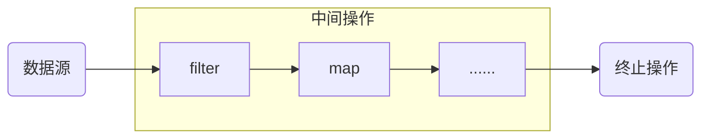

# Java 8 新特性

Java8（又称为jdk 1.8）是Java语言开发的一个主要版本。
Java 8是oracle公司于2014年3月发布，可以看成是自Java5以来最具革命性的版本。Java8为Java语言、编译器、类库、开发工具与JVM带来了大量新特性。

- 速度更快
- 代码更少（增加了新的语法：Lambda表达式）
- 强大的Stream APl便于并行
- 最大化减少空指针异常：Optional 
- Nashorn引擎，允许在JVM上运行JS应用

## 2、并行流与串行流

并行流就是把一个内容分成多个数据块，并用不同的线程分别处理每个数据块的流。相比较串行的流，**并行的流可以很大程度上提高程序的执行效率**。
Java8中将并行进行了优化，我们可以很容易的对数据进行并行操作。
Stream API 可以声明性地通过parallel()与sequential()在并行流与顺序流之间进行切换。

## 一、Lambda表达式

Lambda是一个**匿名函数**，我们可以把Lambda表达式理解为是一段可以传递的代码（将代码像数据一样进行传递）。使用它可以写出更简洁、更灵活的代码。作为一种更紧凑的代码风格，使Java的语言表达能力得到了提升。

1. 举例：(o1, o2) -> Integer.compare(o1, o2);
2. 格式：

*      -> ：lambda操作符 或箭头操作符
*      ->左侧：lambda形参列表（其实就是接口中的抽象方法的形参列表）
*      ->右侧：lambda体（其实就是重写的抽象方法体）

3. Lambda表达式的使用：（分六种情况）

*  总结：
*  ->左侧：lambda形参列表的参数类型可以省略（类型腿短）；如果lambda形参列表只有一个参数，其一对()也可以省略。
*  ->右侧：lambda体应该使用一对{}包裹；如果Lambda体只有一条执行语句（可能是return语句），可以省略这一对{}和return

4. Lambda表达式的本质：作为函数式接口的实例

## 二、函数式(Function)接口

- 只包含一个抽象方法的接口，称为函数式接口。
- 你可以通过Lambda表达式来创建该接口的对象。（若Lambda表达式抛出一个受检异常（即：非运行时异常），那么该异常需要在目标接口的抽象方法上进行声明）
- 我们可以在一个接口上使用@Functionallnterface注解，这样做可以检查它是否是一个函数式接口。同时javadoc也会包含一条声明，说明这个接口是一个函数式接口。
- 在java.util.function包下定义了Java8的丰富的函数式接口

> Java从诞生日起就是一直倡导“一切皆对象”，在Java里面面向对象(OOP)编程是一切。但是随着python、scala等语言的兴起和新技术的挑战，Java不得不做出调整以便支持更加广泛的技术要求，也即java不但可以支持OOP还可以支持OOF（面向函数编程）在函数式编程语言当中，函数被当做一等公民对待。
>
> 在将函数作为一等公民的编程语言中，Lambda表达式的类型是函数。但是在Java8中，有所不同。在Java8中，Lambda表达式是对象，而不是函数，它们必须依附于一类特别的对象类型——函数式接口。
>
> 简单的说，在Java8中，Lambda表达式就是一个函数式接口的实例。这就是Lambda表达式和函数式接口的关系。也就是说，只要一个对象是函数式接口的实例，那么该对象就可以用Lambda表达式来表示。
>
> 所以以前用匿名实现类表示的现在都可以用Lambda表达式来写。

### java内置函数式接口

|        函数式接口        | 参数类型 | 返回类型 | 用途                                                         |
| :----------------------: | -------- | :------: | ------------------------------------------------------------ |
|  消费型接口 Consumer<T>  | T        |   void   | 对类型为T的对象应用操作，包含方法：void accept(T t)          |
|  供给型接口 Supplier<T>  | 无       |    T     | 返回类型为T的对象，包含方法：T get()                         |
| 函数型接口 Function<T,R> | T        |    R     | 对类型为T的对象应用操作，并返回结果。结果是R类型的对象。包含方法：R apply(T t) |
| 断定型接口 Predicate<T>  | T        | boolean  | 确定类型为T的对象是否满足某约束，并返回boolean值。包含方法：boolean test(T t) |

### 其他接口

|                        函数式接口                        |                   |                   |                             用途                             |
| :------------------------------------------------------: | :---------------: | :---------------: | :----------------------------------------------------------: |
|                   BiFunction<T，U，R>                    |        T,U        |         R         | 对类型为T,U参数应用操作，返回R类型的结果。包含方法为：R apply(T t,U u) |
|            UnaryOperator<T>（Function子接口）            |         T         |         T         | 对类型为T的对象进行一元运算，并返回T类型的结果。包含方法为：T apply(T1 t1) |
|          BinaryOperator<T>（BiFunction子接口）           |        T,T        |         T         | 对类型为T的对象进行二元运算，并返回T类型的结果。包含方法为：T apply(T1 t1,T2 t2) |
|                   BiConsumer<T，U>T，U                   |                   |                   |  对类型为T,U参数应用操作。包含方法为：void accept(T t,U u)   |
|                  BiPredicate<T，U>T，U                   |                   |      boolean      |              包含方法为：boolean test(T t,U u)               |
| ToIntFunction<T>、ToLongFunction<T>、ToDoubleFunction<T> |         T         | int、long、double |              分别计算int、long、double值的函数               |
|    IntFunction<R>、LongFunction<R>、DoubleFunction<R>    | int、long、double |         R         |          参数类型分别为int、long、double类型的函数           |

## 三、方法引用与构造器引用

### 1、方法引用(Method References)

- 当要传递给Lambda体的操作已经有实现的方法了，可以使用方法引用
- 方法引用可以看做是Lambda表达式深层次的表达。换句话说，方法引用就是Lambda表达式，也是函数式接口的一个实例，通过方法的名字来指向一个方法，可以认为是Lambda表达式的一个语法糖
- 要求：实现接口的抽象方法的参数列表和返回值类型，必须与方法引用的方法的参数列表和返回值类型保持一致
- 格式：使用操作符"::"将类（或对象）与方法名隔开来
- 如下三种主要使用情况
  - 对象::实例方法名
  - 类::静态方法名
  - 类::实例方法名
- 情况一和情况二的方法引用使用的要求：要求接口中的抽象方法的形参列表和返回值类型与方法引用的方法形参列表和返回值类型相同

### 2、构造器引用

- 构造器引用
  - 和方法引用类似，函数式接口的抽象方法的形参列表和构造器的形参列表一致
  - 抽象方法的返回值类型即为构造器所属的类
- 数组引用
  *  可以把数组看做是一个特殊的类，则写法与构造器一致

## 四、强大的StreamAPI

### 介绍

- Java8中有两大最为重要的改变。第一个是Lambda表达式；另一个则是Stream API。
- Stream API(java.util.stream)把真正的函数式编程风格引入到Java中。这是目前为止对Java类库的最好补充，因为Stream API可以极大的提供Java程序员的生产力，让程序员写出高效、干净、简洁的代码。
- Stream是Java8中处理集合的关键抽象概念，它可以指定你希望对集合进行的操作，可以执行非常复杂的查找、过滤和映射数据库等操作。使用Stream API对集合数据进行操作，就类似于使用SQL进行数据库的查询。也可以使用Stream API来并行执行操作。简而言之，Stream API提供了一种高效且易于使用的处理数据的方式。

### 为什么要用

- 实际开发中，项目中多数数据源都来自于Mysql，Oracle等。单现在数据源可以更多了，有MonDB，Redis等，而这些NoSQL的数据就需要Java层面去处理
- Stream和Collection集合的区别：Collection是一种静态的内存数据结构，而Stream是有关计算的。前者是主要面向内存，存储在内存中，后者主要是面向CPU，通过CPU实现计算。

### 什么是Stream

是数据渠道，用于操作数据源(集合、数组等)所生成的元素序列。

> 集合讲的是数据，Stream讲的是计算

**注意**：

1. Stream自己不会存储元素
2. Stream不会改变源对象。相反，他们会返回一个持有结果的新Stream。
3. Stream操作时延迟执行的。这意味着他们会等到需要结果的时候才执行。

### Stream流程

#### 1.创建Stream

一个数据源(如：集合、数组)，获取一个流

#### 2中间操作

一个中间操作链，对数据源的数据进行处理

#### 3.终止操作（终端操作）

一旦执行终止操作，就执行中间操作链，并产生结果。之后，不会再被使用

### 创建Stream

#### 方式一：通过集合

Java8中的Collection接口被扩展，提供了两个获取流的方法：

- default Stream\<E\> stream()：返回一个顺序流
- default Stream\<E\> parallelStream()：返回一个并行流

#### 方式二：通过数组

Java8中的Arrays的静态方法stream()可以获取数据流：

- static \<T\> Stream\<T\> stream(T[] array)：返回一个流

通过重载，能够处理基本类型的数组：

- public static IntStream stream(int[] array)
- public static LongStream stream(long[] array)
- public static DoubleStream stream(double[] array)

#### 方法三：通过Stream的of()

可以调用Stream类的静态方法of()，通过显示值创建一个流。它可以接受任意数量的参数。

- public static\<T\> Stream\<T\> of(T... values)：返回一个流

#### 方法四：创建无线流

可以使用静态方法Stream.iterate()和Stream.generate()，创建无限流

- public static\<T\> Stream\<T\> iterate(final T seed, final UnaryOperator\<T\> f)
  - 迭代

- public static\<T\> Stream\<T\> generate(Supplier\<T\> s)
  - 生成

### Stream的中间操作

多个中间操作可以连接起来形成一个流水线，除非流水线上触发终止操作，否则中间操作不会执行任何的处理！而在终止操作时的一次性全部处理，称为“惰性求值”

#### 筛选与切片

|        方法         |                             描述                             |
| :-----------------: | :----------------------------------------------------------: |
| filter(Predicate p) |                接收Lambda，从流中排除某些元素                |
|     distinct()      | 筛选，通过流所生成元素的hashCode（）和equals（）去除重复元素 |
| limit(long maxSize) |                截断流，使其元素不超过给定数量                |
|    skip(long n)     | 跳过元素，返回一个扔掉了前n个元素的流。若流中元素不足n个，则返回一个空流。与limit(n)互补 |

#### 映射

|               方法               |                             描述                             |
| :------------------------------: | :----------------------------------------------------------: |
|         map(Function f)          | 接收一个函数作为参数，该函数会被应用到每个元素上，并将其映射成一个新的元素。 |
| map ToDouble(ToDoubleFunction f) | 接收一个函数作为参数，该函数会被应用到每个元素上，产生一个新的DoubleStream。接收一个函数作为参数，该函数会被应用到每个元素上，产生一个新的IntStream。 |
|    map Tolnt(TolntFunction f)    | 接收一个函数作为参数，该函数会被应用到每个元素上，产生一个新的IntStream。 |
|   map ToLong(ToLongFunction f)   | 接收一个函数作为参数，该函数会被应用到每个元素上，产生一个新的LongStream。 |
|       flatMap(Function f)        | 接收一个函数作为参数，将流中的每个值都换成另一个流，然后把所有流连接成一个流。 |

#### 排序

|          方法          |                描述                |
| :--------------------: | :--------------------------------: |
|        sorted()        |  产生一个新流，其中按自然顺序排序  |
| sorted(Comparator com) | 产生一个新流，其中按比较器顺序排序 |

### Stream的终止操作

- 终端操作会从流的流水生成结果。其结果可以是任何不适流的值，例如List、Integer，甚至是void
- 流进行了终止操作后，不能再次被使用

#### 匹配与查找

|          方法          |                             描述                             |
| :--------------------: | :----------------------------------------------------------: |
| allMatch(Predicate p)  |                     检查是否匹配所有元素                     |
| anyMatch(Predicate p)  |                   检查是否至少匹配一个元素                   |
| noneMatch(Predicate p) |                   检查是否没有匹配所有元素                   |
|      findFirst()       |                        返回第一个元素                        |
|       findAny()        |                    返回当前流中的任意元素                    |
|        count()         |                       返回流中元素总数                       |
|   max(Comparator c)    |                        返回流中最大值                        |
|   min(Comparator c)    |                        返回流中最小值                        |
|  forEach(Consumer c)   | 内部迭代（使用Collection接口需要用户去做迭代，称为外部迭代。相反，Stream API使用内部迭代实现） |

#### 规约

|               方法               |                           描述                            |
| :------------------------------: | :-------------------------------------------------------: |
| reduce(T iden, BinaryOperator b) |       可以将流中元素反复结合起来，得到一个值。返回T       |
|     reduce(BinaryOperator b)     | 可以将流中元素反复结合起来，得到一个值。返回Optional\<T\> |

> 注：map和reduce的连接通常称为map-reduce模式，因Google用它来进行网络搜索而出名。

#### 收集

|         方法         |                             描述                             |
| :------------------: | :----------------------------------------------------------: |
| collect(Collector c) | 将流转换为其他形式。接受一个Collector接口的实现，用于给Stream中元素做汇总的方法。 |

Collector接口中方法的实现决定了如何对流执行收集的操作（如收集到List、Set、Map）。

另外，Collectors使用类提供了很多静态方法，可以方便地创建常见收集器实例，具体方法与实例见下表：

Stream API : Collectors

| 方法           | 返回类型             | 作用                                    |
| :------------- | :------------------- | :-------------------------------------- |
| toList         | List\<T\>            | 把流中元素收集到List                    |
| toSet          | Set\<T\>             | 把流中元素收集到Set                     |
| toCollection   | Collection\<T\>      | 把流中元素收集到创建的集合              |
| counting       | Long                 | 计算流中元素的个数                      |
| summingInt     | Integer              | 对流中元素的整数属性求和                |
| averagingInt   | Double               | 计算流中袁术Integer属性的平均值         |
| summarizingInt | IntSummaryStatistics | 收集流中Integer属性的统计值。如：平均值 |

## 五、Optional类

- 到目前为止，臭名昭著的空指针异常时导致Java应用程序失败的最常见原因。以前，为了解决空指针异常，Google公司著名的Guava项目映入了Optional类，Guava通过使用检查控制的方式来防止代码污染，它鼓励程序员写更干净的代码。收到Google Guava的启发，Optional类已经成为Java 8类库的一部分。
- Optional\<T\>类（java.util.Optional）是一个容器类，它可以保存类型T的值，代表这个值存在。或者仅仅保存null，表示这个值不存在。原来用null表示一个值不存在，现在Optional可以更好的表达这个概念。并可以避免空指针异常。
- Optional类的Javadoc描述如下：这是一个可以为null的容器对象。如果值存在则isPresent()方法会返回true，调用get()方法会返回该对象。

Optional提供很多有用的方法，这样我们就不用显式进行空值检测。

- 创建Optional类对象的方法：
  - Optional.of(T t)：创建一个Optional实例，t必须非空
  - Optional.empty()：创建一个空的Optional实例
  - Optional.ofNullable(T t)：t可以为null
- 判断Optional容器中是否包含对象
  - boolean isPresent(Consumer<? super T> comsumer)：如果有值，就执行Comsumer接口的实现代码，并且该值会作为参数传它。
- 获取Optional容器的对象
  - T get()：如果调用对象包含值，返回该值，否则抛异常
  - T orElse(T other)：如果有值则将其返回，否则返回指定的other对象。
  - T orElseGet(Supplier<? extends T> other)：如果有值则将其返回，否则返回由Supplier接口实现提供的对象。
  - T orElseThrow(Supplier<? extends X> exceptionSupplier)：如果有值则将其返回，否则抛出由Supplier接口实现提供的异常。